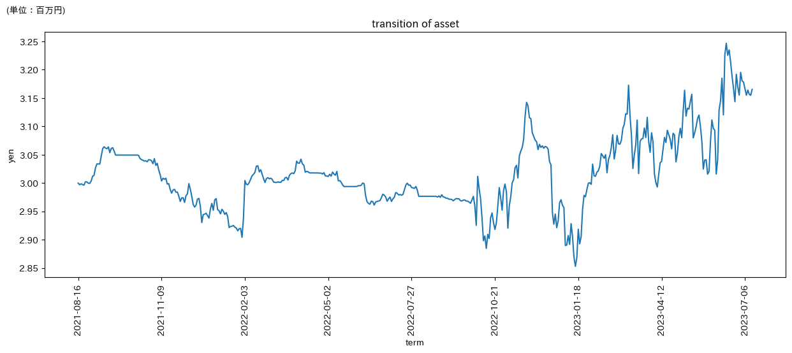

## 当プログラムの機能概要
- このプログラムは，株式取引における売買ルールを過去の株価データで検証(=バックテスト)するものです．
- 過去の株価データは，東京証券取引所のJ-Quantsを利用します．
   - J-Quantsに無料会員登録すれば，2年分の株価データを利用できます．  
      (有料なら10年以上のデータを取得可)
   - なお，当プログラムは2年以上の期間でも利用できるようにコーディングしています．
- 同じ機能を持つ市販のプログラムに「[イザナミ](https://www.izanami.jp/top.html)」がありますが，こちらは高価だから...といった方向けです．

## 売買ルール
- 売買ルールとは，株式を売買する時の指標として，予め決めておくルールのことです．
- 主に利用される指標には，株価，移動平均線，MACD，RSI，ストキャスティクス，一目均衡表などがあります．
- 具体的な売買ルールには，「平均売買代金が五千万以上かつ，MACDがシグナルを上回った時に買い．MACDがシグナルを下回った時に売る」などがあります．

## 出力例
- 当プログラムの最終出力は，ユーザが指定した売買ルールの検証結果のグラフです．
- datas/backtest/asset_log.pngです．
- 横軸が日付，縦軸が資産総額です．


 
## 使い方
1. Pythonおよび必要ライブラリをダウンロード 
ライブラリは以下参考
```
!pip install matplotlib
!pip install japanize-matplotlib
!pip install pandas
!pip install tqdm
!pip install bottleneck
!pip install requests
!pip install joblib

```
2. J-Quantsに会員登録し，無料のプランを選択(2年以上に渡って検証したければ有料プラン)
3. 必要なディレクトリを作成
```
cd datas
mkdir code
mkdir image
mkdir price
cd ..
mkdri etc
```
4. J-Quantsから株価をダウンロードするのに必要なファイルを作成
```
cd etc
nano mail-pass.txt
```
以下はmail-pass.txtの例, <>は必要ありません
```
<J-Quantsに登録したメールアドレス>
<同じく登録したパスワード>
```
5. J-Quantsから銘柄コードをダウンロード
   1. request.pyの変数"get_Token"をTrueに変更
   2. 同じく変数"get_code"をTrueに変更
   3. request.pyを実行
   4. info2code.pyの変数をWHENを，3で作成された，datas/code/内のファイル名の数字部分に変更
   5. info2code.pyを実行
6. J-Quantsから株価をダウンロード
   1. request.pyの変数"get_code"をFalseに変更
   2. 同じく変数"get_price"をTrueに変更
   3. request.pyを実行
   4. summary_price.pyを実行
7. 売買ルールを検証
   1. backtest.pyを実行
   - なお，backtest.py中で，株価データはprices_normalというリストに格納されています．
   - リストに格納されている値の詳細は，datas/datas_explanation/prices.txtを参照してください．
   - 売買ルールを変更したいとき：backtest.py内，関数decide_buy_codeのjudge_buyがTrueとなると，その株価が購入の候補となり，1単位購入可能な資金があれば購入されます．よって，judge_buyの条件を変更してください．


## 補足
- 当プログラムの使用は自己責任でお願いします．
  
